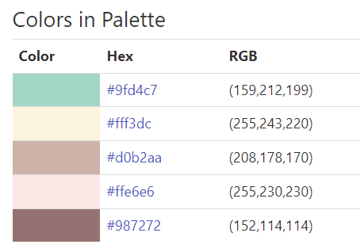
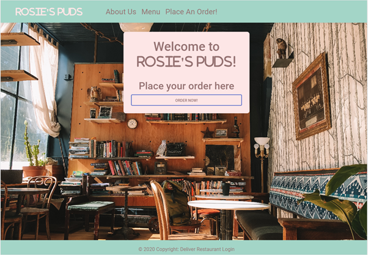
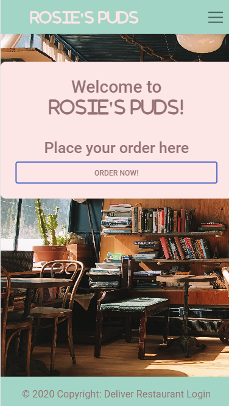
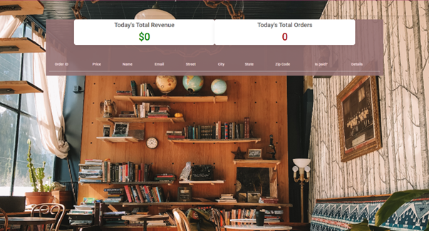
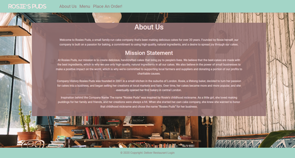
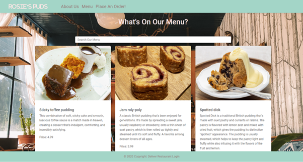
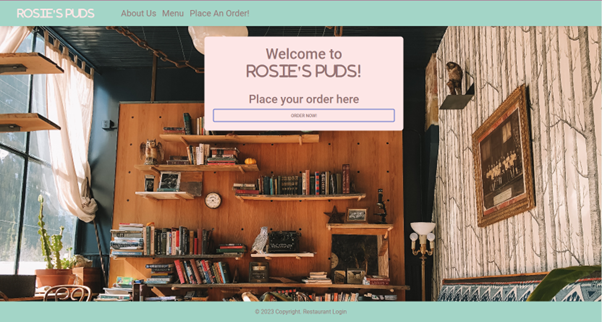
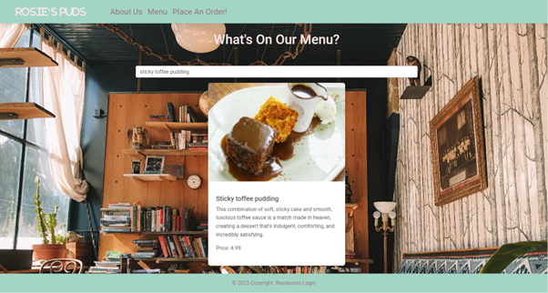

# Rosie's puds - Introduction

**Rosie's puds** Rosie's puds is a dessert website for those with a sweet tooth. I have used this as the website for my final project for a Code Institute bootcamp. This project uses Django full stack framework.

> It targets **puddings, traditional and new** of a large variety in order to delight and create a positive emotional response in the website user. These puddings are a lovely treat presented in a visually pleasing and easy to navigate way. This satisfies the need of the user to find a sweet treat easily, and then makes the sales and delivery process of that sweet treat smooth and trouble free.
The user can view the pictures of the puddings that they might like, order a pudding easily and organise payment and delivery of said pudding easily too.

You can view the live site here:- [implement this]


----

## [Content](#content)
- [Rosie's puds - Introduction](#rosies-puds---introduction)
  - [User Experience - UX](#user-experience---ux)
    - [Site Aims](#site-aims)
    - [Agile Methodology](#agile-methodology)
      - [Epics and User Stories](#epics-and-user-stories)
      - [Tasks](#tasks)
  - [Design](#design)
    - [Colours](#colours)
    - [Typography](#typography)
    - [Imagery](#imagery)
    - [Wireframes](#wireframes)
  - [Database Diagram](#database-diagram)
  - [Features](#features)
    - [Home Page](#home-page)
      - [Navbar](#navbar)
      - [Hero Image](#hero-image)
      - [Destination Section](#destination-section)
      - [Footer](#footer)
    - [User Page](#user-page)
    - [About Page](#about-page)
    - [Blog Page](#blog-page)
      - [Blog Details](#blog-details)
      - [Blog Comments](#blog-comments)
    - [Register](#register)
    - [Login](#login)
    - [Logout](#logout)
    - [Destinations](#destinations)
    - [Search Button](#search-button)
    - [Alert Messages](#alert-messages)      
  - [Admin Panel/Superuser](#admin-panelsuperuser)
  - [Technologies Used](#technologies-used)
    - [Languages Used](#languages-used)
    - [Django Packages](#django-packages)
    - [Frameworks - Libraries - Programs Used](#frameworks---libraries---programs-used)
  - [Testing](#testing)
      - [Validation](#validation)
      - [Manual Testing](#manual-testing)
  - [Bugs](#bugs)
      - [Fixed Bugs](#fixed-bugs)
      - [Unfix Bugs](#unfix-bugs)
  - [Deployment](#deployment)
      - [Creating the Django project](#creating-the-django-project)
      - [Creating Heroku app](#creating-heroku-app)
      - [Set up Environment Variables](#set-up-environment-variables)
      - [Heroku deployment](#heroku-deployment)
      - [Final Deployment](#final-deployment)
  - [Credits](#credits)
    - [Content](#content)
    - [Information Sources / Resources](#information-sources--resources)
  - [Acknowledgement](#acknowledgement)

-----

# User Experience - UX

## Site Aims

* Rosie's puds is a website that aims to show users great puddings that they can order, pay for and organise the delivery of in one easy to navigate place.
* The site gives the user a positive emotional experience by being easy to navigate, visually pleasing and excites the user by giving them the possibility of a tasty pudding arriving at their door.
* This website provides the user with the ability to see the puddings and choose as many as they would like for delivery.
* Staff who organise delivery can mark an order as delivered and can mark an order as paid. They can see all orders, order ID, whether it has been paid or not and whether it has been delivered or not.
* Business owners/super-user can also see the number of orders, order ID, total revenue taken, whether an order is paid and whether an order has been delivered. They can also add and delete items from the database and website.
* Super-user can access all the features of the website and can read, create, edit, and delete puddings or info of their choosing.

## Agile Methodology

The Agile Methodology was used to plan this project. This was implemented through Trello and the kanban board. Using this Kanban board I divided the project into several sections: 

* Design- This held all the design tasks for the project.
* To do- These were tasks yet to be completed, once began these were moved to the "Doing" label.
* Doing- Once tasks had begun they were moved to this column.
* Testing- These held the testing protocol for the project.
* Done- this holds all the completed tasks.
Please find my Kanban Board here .

## Epics and User Stories

Following Epics were created which were further developed into several User Stories.

### Epic 1- Website UI
Epic Goals for User- 
* Easy to navigate and find the pudding of your choice.
* Easy to add the pudding to your basket, pay for it and organise delivery of it.
* Search bar for regular customers or new customers to find their favourite pudding, or a pudding of their desire.
* Can immediately see the purpose of the site once landing upon it.

#### Related User Stories:
* As a site user I can easily see the point of the site, so that I can stay on it and find what I need or leave immediately because it's not something I want.
* As a site user I can view a list of the puddings so I can find the one I want.
* As a site user I can use the search bar to find the pudding that I want.
* As a site user I can click on a pudding to add it to my basket.
* As a site user I can see a description of the pudding so that I can see if I want to order it.

### Epic 2- Registration and Account Management
Epic Goals-
* Quick and easy creation of staff account.
* Quick and easy sign up, sign in and sign out of the super user and staff.
* Upon signing in, the user should be able to add a pudding, delete a pudding, change the description of a pudding, add staff users (easy access to Create, Read, Update and Delete (CRUD) features)

#### Related User Stories:
* As a staff user, I can register an account so that I can make changes to the orders.
* As a staff user, I can login and logout of the site so that I can access the orders.
* As a staff and super user, I can view the number of orders, see which ones have been paid and which ones have been shipped.
* As a super user I can make changes to the description and pictures of the puddings on the website.

### Epic 3- Pudding Post Management
Epic Goals-
* Create/ Update / Read / Delete pudding images and descriptions.
* View the created puddings.
* Approve and publish a picture and description of a pudding.

#### Related User Stories:
* As a site admin/author, I can create, read, update and delete posts to manage the blog content.
* As a site admin, I can delete any pudding so that when puddings have ran out, the site visitor will no longer see them.
* As a super user I can see the total revenue, the current orders and what stage of the process they are at (shipped or not? paid or not?) helping me to keep track of what is going on with the business.

## Tasks

The tasks created for this project were put together following the tasks and order of the Django project "I Think Therefore I Blog" and Legion Script's YouTube channel series for the creation of a food delivery app.

**Before Project Inception**

- Design Entity Relationship Diagram in order to understand which data I wanted to gather and how it would relate to itself.
- Create Repository in GitHub and install Django, Bootstrap and Crispyforms.
- Create Project, Epics, User Stories and organise project tasks on Kanban Board in Trello.

**Creation of Project in GitPod**

- Create the Django project.
- Create the database models
- Set up models.py file in "rosecafe/restaurant" directory
- Set up Index and About pages: this includes creating base.html which contained the Navbar and Footer content, which I used in all template files. This created the consistency of the design of the project.
- Set up other Template files: about.html, footer.html, index.html, menu.html, navigation.html, order_confirmation.html, order_pay_confirmation.html, order.html.
- Set up views.py and urls.py
- Set up order system
- Add payment system
- Create staff login and dashboard.
- Add order details.
- about.html (Description about Rosie's Puds)
- footer.html (footer containing our restaurant login and copyright details)
- index.html(homepage containing the order now button and hero image)
- menu.html ( contains the puddings available for order)
- navigation.html(the navigation bar holding the buttons to order, get info about the company and to see the menu)
- order_confirmation.html(to confirm to the customer their order has gone through successfully)
- order_pay_confirmation.html(confirms to the user that they have paid successfully)
- order.html (takes the details of the delivery for the order)
- Install Allauth for sign in, sign up and sign out templates with-  pip3 install django-allauth 
- Install crispy-forms to add styles to Django account templates with-  pip3 install crispy-bootstrap4
- Deployment

-----

[Back to top](#content)

## Design

### Colours

The colour scheme is inspired by other sweet treat websites. I chose pastel colours associated with sweets in order for the website to be consistent with the baking industry.  



### Typography

I trusted the typography created by the developers at Bootstrap and have used this throughout the website.

### Imagery

All imagery is related to cakes and puddings as this is the produce the website is selling, aimed to entice the viewer to purchase through strong appealing imagery.

### Wireframes

The wireframes for this projected were generated using Canva. 
- [Wireframes for Desktop Homepage](readme_pictures/homepage_desktop.png)
- [Wireframes for Desktop About Us](readme_pictures/about_us_desktop.png)
- [Wireframes for Desktop Order](readme_pictures/order_page.png)
- [Wireframes for Mobile Menu and Order](readme_pictures/mobile_menu_order.png)
- [Wireframes for Mobile ](readme_pictures/mobile_about_us.png)

----

## Database Diagram

ERDplus was used to create a database schema to visualise the types of database models this project needed. In hindsight this project could use a "customer" model which would allow for customer login and more customer data to be stored.


[Back to top ⇧](#content)

----

# Features

## Home Page

- The user can immediately tell what the page is about.
- The hero image is pleasing and appetising enticing the user to view further products.
- The user can immediately navigate through to the other pages to see the menu of products, information about the company (about Us) and place an order.






----

## Navbar

- The nav bar is present on all pages and means the user doesn't need to press the back button lots.
- The navbar is responsive and clear.


## User Page

* The logged in super user and staff can see a dashboard with all orders, total revenue, the shipping status of each order, the paid status of each order, and the total number of orders.
* Each order has an: ID, price, name, email, street, city, state, zip code, and a space for details.

 

----

## Footer

- The website footer contains the copyright information for the company, the login button for staff/user and another deliver button.


----

## About Page

- The About Page gives users information about Rosie's puds company and the current business. This adds a human touch to the site.


----

## Menu Page

This page contains the menu of different puddings available to buy. These images are intended to entice and encourage the user to buy.



----

## Deliver Page

- This page contains a very obvious call to action button that encourages the customer to place an order.
- When the customer clicks the button it takes them through to the website page.



----

## Search Button 

On the Menu page there is a search bar to allow users to find a favourite regular order, or see if there is a particular pudding they are hoping to find.


- On the search results page customers can see the corresponding puddings to their search query.



----

[Back to top ⇧](#content)

## Superuser access

- The superuser can access the backend of the site by inputting their username and password. The page appears like so:

[here](readme_pictures/admin_page.png).

- On the Admin Panel accessible to the superuser, I can carry out all CRUD functions so I can view, create, edit and delete menu items (puddings).
- The superuser can also give other permissions to staff users and alter orders too.

### Admin 'Pudding Item' Model Management

- On selecting Menu Items in Customer, a list of Menu Items is displayed. When a menu item is selected, the superuser can see the: item name, description, image, price and category.
- The superuser can select menu items, delete them, add them and edit their associated information.

The admin site for pudding item model appears as shown [here](assets/features/admin-panel-post-model.jpg).

### Admin 'Order' Model Management

- Upon selecting the order model under customer in the admin panel, the superuser can see a list of orders with the date and time the order was placed.
- When the superuser clicks on an order, it displays the: price, menu items ordered, the name, email and address details of the person who sent the order. The order also has a paid check box and a shipped check box. These are either checked or unchecked depending on the status of the order.

The admin site for order model appears as shown [here](assets/features/admin-panel-comment-model.jpg).


----

## Technologies Used

### Languages Used

* HTML 5- used for the templates and therefore site content.
* CSS 3- for styling of the site.
* Python- For site functionality.

### Django Packages

* Gunicorn.
* Psycopg2.
* Allauth - for registration, authentication and account management.
* Crispy Forms - for form styling.

### Frameworks - Libraries - Programs Used

* Django framework held the project and connected the Model, View and Controller.
* Bootstrap4: used to style the wesbite and for responsiveness.
* Git for version control.
* PostgreSQL for the project database.
* Canva to build the wireframes for the project.
* Google Chrome Developer Tools to understand bugs and to test the site using the Lighthouse function.
* Font Awesome for icons used on the site.

-----

[Back to top ⇧](#content)

## Testing

### Validation
In order to test my site I used the following tools:
- [W3C HTML validator](https://validator.w3.org/) to test HTML
- [Jigsaw CSS validator](https://jigsaw.w3.org/css-validator/) to test CSS.
- [PEP8 CI Python Linter](https://pep8ci.herokuapp.com/) to test Python code.

### Manual Testing
Testing that the project performed as expected took place continuously throughout the build. Bugs were fixed before moving on.
----

## Bugs

| **Bug** | **Fix** |
| ----------- | ----------- |
| Whole site would not function.| Had just tried to add authentication, but I had accidentally left out "Mixin" so it would not work. I reviewed my code and added "Mixin" in to code in the appropriate places and the site then worked |
| Problems with allauth | The site would not call in functions of allauth because I had put the templates folder in the wrong place. I moved the templates directory and put the correct file path and the allauth then worked |

----

## Future Implementation

* Add more models to the database so that the site can include drinks to accompany the puddings and an extras menu so that customers can add extra toppings or sauces of their choice.

[Back to top ⇧](#content)


## Deployment

### 1. Creating the Django Project
* Go to the Code Institute Gitpod Full Template [Template](https://github.com/Code-Institute-Org/gitpod-full-template).
* Click on `Use This Template` button, then create new repository.
* Name our repository and click on `Create repository from template` button.
* Once the template is available in your repository click on `Gitpod` button.
* When the image for the template and the Gitpod are ready, open a new terminal to start a new Django App.
* Install Django and gunicorn: `pip3 install 'django<4' gunicorn`.
* Install supporting database libraries dj_database_url and psycopg2 library: `pip3 install dj_database_url==0.5.0 psycopg2`.
* Install Cloudinary libraries to manage static files: `pip install dj-3-cloudinary-storage`.
* Create file for requirements: `pip freeze --local > requirements.txt`.
* Create project:`django-admin startproject project_name .`.
* Create app: `python manage.py startapp app_name`.
* Add app to list of `installed apps` in settings.py file: `'app_name'`.
* Migrate changes: `python manage.py make migrations`.
* Migrate changes 2: `python manage.py migrate`.
* Test server works locally: `python manage.py runserver`.
* If the app has been installed correctly the window will display- The install worked successfully! Congratulations! Accompanied by a picture of an enthusiastic rocket.

### 3. Set up Environment Variables
* In you IDE create a new env.py file in the top level directory.
* Add env.py to the .gitignore file.
* In env.py import the os library.
* In env.py add `os.environ["DATABASE_URL"]` = "Paste the link copied from SQLite DATABASE_URL".
* In env.py add `os.environ["SECRET_KEY"] = "Make up your own random secret key"`.
* In Heroku Settings tab Config Vars enter the same `SECRET_KEY` created in env.py by entering 'SECRET_KEY' in the box for 'KEY' and your randomly created secret key in the 'value' box.

### 4. Setting up settings.py
* In your Django 'settings.py' file type:

 ```
 from pathlib import Path
 import os

 if os.path.isfile("env.py"):
  import env
 ```
* Comment out the `DATABASES` section in settings.py and replace with:
```
DATABASES = {
  'default': 
  dj_database_url.parse(os.environ.get("DATABASE_URL"))
  }`
```
* Create a Cloudinary account and from the 'Dashboard' in Cloudinary copy your url into the env.py file by typing: `os.environ["CLOUDINARY_URL"] = "cloudinary://<insert-your-url>"`
* In Heroku, click Reveal Config Vars and add a new record with the `CLOUDINARY_URL`
* Add Cloudinary libraries to the installed apps section of settings.py file:
 ```
 'cloudinary_storage'
 'django.contrib.staticfiles''
 'cloudinary'
 ```
* Connect Cloudinary to the Django app in `settings.py`:
```
STATIC_URL = '/static'
STATICFILES_STORAGE = 'cloudinary_storage.storage.StaticHashedCloudinaryStorage'
STATICFILES_DIRS = [os.path.join(BASE_DIR, 'STATIC')]
STATIC_ROOT = os.path.join(BASE_DIR, 'staticfiles')
MEDIA_URL = '/media/'
DEFAULT_FILE_STORAGE =
'cloudinary_storage.storage.MediaCloudinaryStorage'
* Link file to the templates directory in Heroku 
* Place under the BASE_DIR: TEMPLATES_DIR = os.path.join(BASE_DIR,
'templates')
```
* Change the templates directory to TEMPLATES_DIR. Place within the TEMPLATES array: `'DIRS': [TEMPLATES_DIR]`
* Add Heroku Hostname to ALLOWED_HOSTS: 
```ALLOWED_HOSTS = ['<Heroku_app_name>.herokuapp.com', 'localhost']```
* Create Procfile at the top level of the file structure and insert the following:
    ``` web: gunicorn PROJECT_NAME.wsgi ```

* Commit and push the code to the GitHub Repository.

### 5. Heroku Deployment: 
* Click Deploy tab in Heroku.
* Select Github as the deployment method.
* Confirm you want to connect to GitHub.
* Search for the repository name and click the connect button to link the heroku app with the Github repository. The box will confirm that heroku is connected to the repository.
* Scroll to the bottom of the deploy page and select the preferred deployment type.
* Click either Enable Automatic Deploys for automatic deployment when you push updates to Github or To manually deploy click the button 'Deploy Branch'. The default 'main' option in the dropdown menu should be selected in both cases. When the app is deployed a message 'Your app was successfully deployed' will be shown. Click 'view' to see the deployed app in the browser.

### 6. Final Deployment
In the IDE:
* When development is complete change the debug setting to: `DEBUG = False` in `settings.py` 
* In Heroku settings config vars change the `DISABLE_COLLECTSTATIC` value to 0
* Because DEBUG must be switched to True for development and False for production it is recommended that only manual deployment is used in Heroku. 
* To manually deploy click the button 'Deploy Branch'. The default 'main' option in the dropdown menu should be selected in both cases. When the app is deployed a message 'Your app was successfully deployed' will be shown. Click 'view' to see the deployed app in the browser.

----

[Back to top](#content)

# Credits

## Code
- I used the CI course content to put together my code as well as Legion Script YouTube channel series "Build a Food Delivery App".
- I worked alongside many colleagues who all contributed to the debugging process and understanding of this project.

## Learning Resources
- Youtube videos by Legion Script.
- Code with Mosh subscription service.
- W3Schools website
- Django documentation
- Stack overflow posts
- Bootstrap documentation

## Content and Media

Images are taken from Pexels and Canva.

----

## Acknowledgement

Thanks to Richey Malhotra and Jack Crane for helping me so much with this project.

[Back to top](<#content>)
   